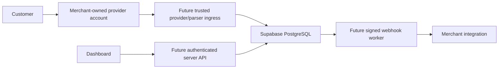

## Current Phase 6

Six prior migrations applied; parser lifecycle migration unapplied. See [management](parser-device-management.md),
[protocol](parser-protocol.md) and [Phase 6 report](../phase-6-implementation.md). Internal
parser routes now exist but require NODE_ENV=test and explicit flag; production fails closed.
Earlier statements about missing routes describe the Phase 5 snapshot.

# Current Phase 5 boundary

Five migrations through Phase 4 are applied. Sixth synthetic-ingestion migration is unapplied.
Source-authenticated local test transport only; no HTTP ingestion, real source adapter or live
behavior. See [ingestion architecture](evidence-ingestion.md) and [Phase 5 report](../phase-5-implementation.md).
Historical Phase 4 and older summaries below do not describe current migration inventory.

Four Phase 1–3 migrations are applied. The fifth synthetic verification migration is
unapplied; private DBA gate starts disabled and service/client cannot activate it.
No real ingestion/provider/payment/webhook or BD21topup integration. Explicit environments,
deterministic immutable decisions and atomic test-only verification are implemented.
See [current report](../phase-4-implementation.md). Earlier phase summaries below are
historical; their migration counts/defaults are not the current inventory.

# EkPay architecture

Current Phase 3 status (2026-09-27): all three Phase 1/2 migrations are remotely
applied. Development-only create/read API uses shared HMAC and service-only
transactional RPCs; its fourth migration is unapplied. No live verification,
provider connection, fund handling or webhook delivery is enabled. See
[API architecture](payment-intent-api.md) and [launch gate](../compliance/launch-gate.md).

## Historical Phase 1/2 design snapshot below

Current status: both Phase 1 migrations are applied. Phase 2 Auth/dashboard/key
application code is implemented locally; its new migration is not applied.
See [Phase 2 review](../phase-2-implementation.md). Phase 1 descriptions below
reflect the earlier design snapshot; runtime payment features remain deferred.

Status: Phase 1 schema design, not a live payment service. Next.js 16.3.6,
React 19.2.8 and TypeScript form the initialized application. Supabase/PostgreSQL
hosts the five applied core tables. The second migration remains local/unapplied.

EkPay's intended role is verification and notification. Customers pay a
merchant-owned bKash, Nagad, Rocket or Upay account directly; EkPay does not hold
merchant funds or implement a wallet in this design.

Only the application scaffold, initial schema, proposed infrastructure migration
and local security tests exist now. Ingress, matching APIs, authentication UI,
workers and integrations are future work. Read [payment flow](payment-flow.md),
[tenant design](multi-tenant-design.md) and [review](../database/pre-apply-review.md).

Future `/v1/...` APIs should translate caller credentials into explicit merchant
authorization before using privileged DB access. Shared domain logic should serve
Android/Kotlin, PHP/Laravel, WooCommerce, WHMCS and BD21topup clients; none are
implemented integrations or operational dependencies today.
